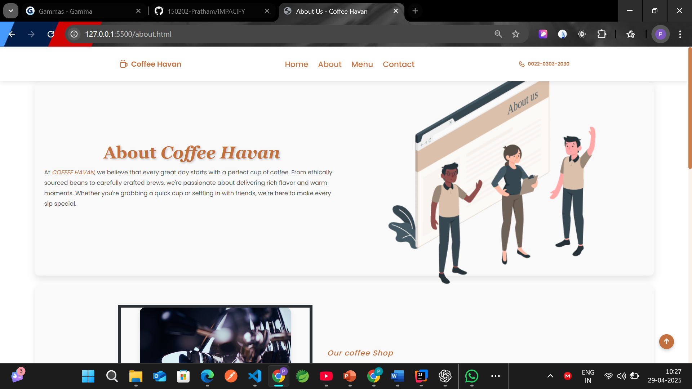
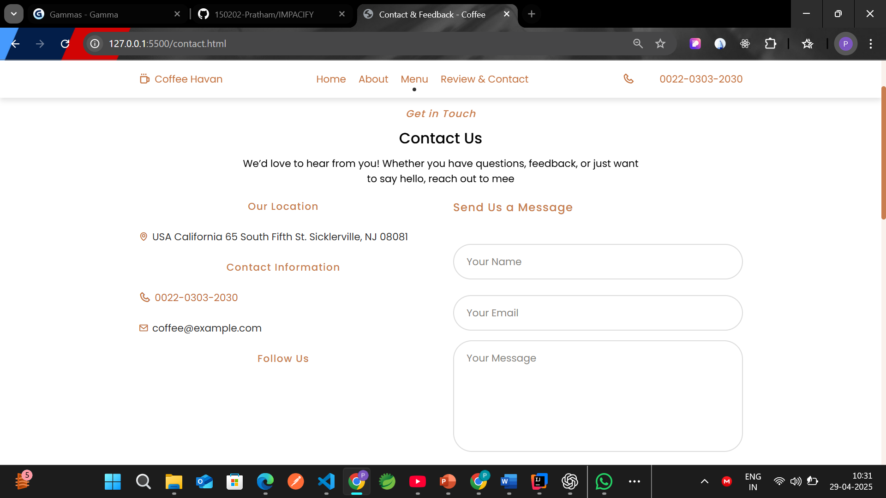
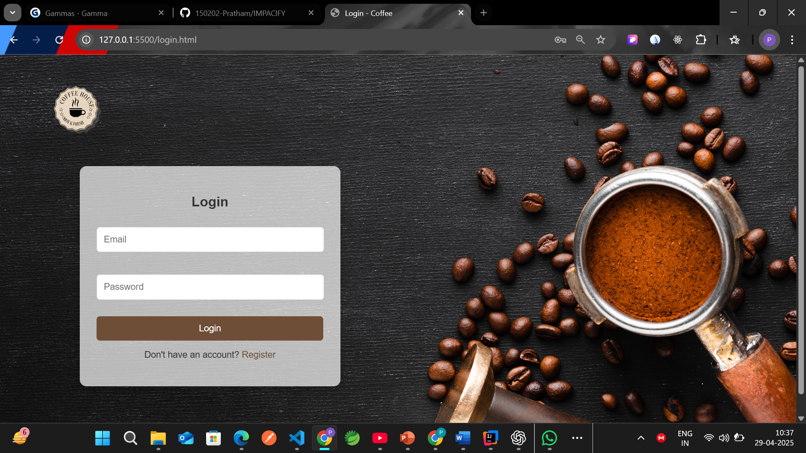

# IMPACIFY – Brewing Impact, One Cup at a Time ☕

Project Description:

IMPACIFY is a coffee e-commerce website built as a real-life project for Source Code Management. 
It blends a smooth user experience with an impact-driven mission, promoting sustainable coffee sourcing and ethical consumer practices.

## 🖼️ Screenshots

### Home Page

### Menu Page

### About Page

### Contact Page

### Order Page

### Login/Signup Page

## ✨ Features

- User registration and login
- Menu browsing and cart
- Order placement
- JSON-based backend order storage
- Clean and responsive UI

## 🔧 Tech Stack
- **Frontend**: HTML5, CSS3, JavaScript
- **Backend**: Node.js, Express.js
- **Database**: JSON file (orders.json)
- **Version Control**: Git & GitHub

## 👥 Collaborators
- Pratham (Team Lead)
- Satyam Godara
- Pulkit Sachdeva
- Dhruvi
- Sukhrattan

## 🙏 Acknowledgements
Thanks to our faculty and peers for continuous support and Source Code Management guidance.
