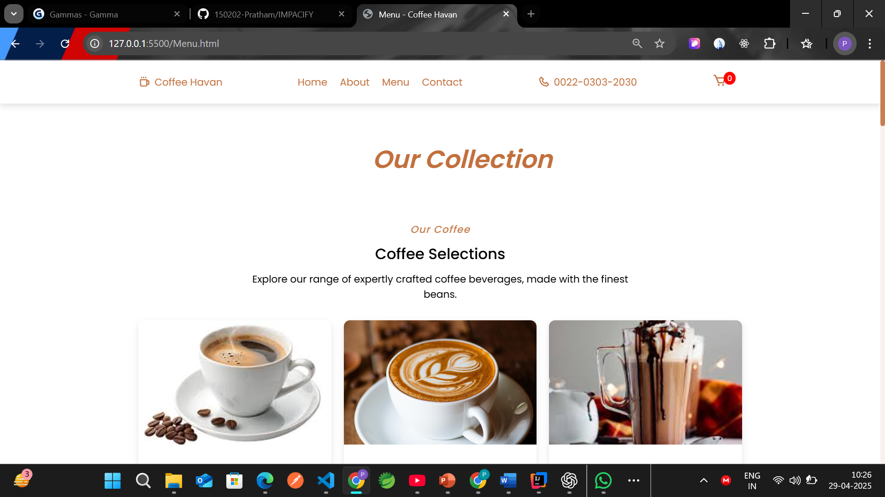
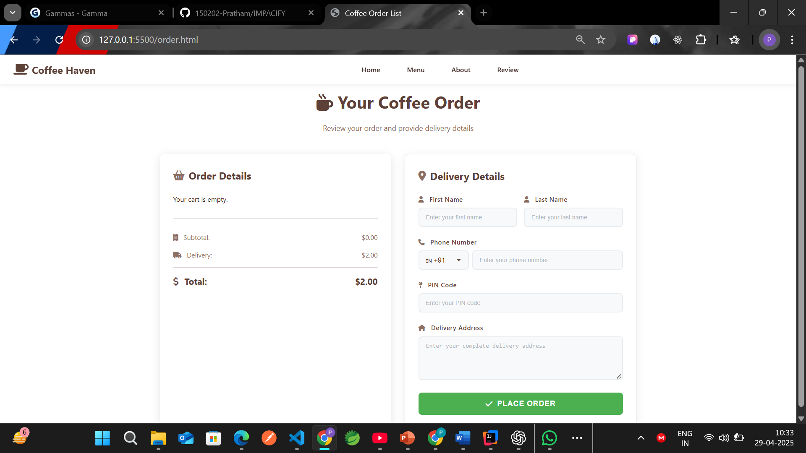

# IMPACIFY – Brewing Impact, One Cup at a Time ☕

Project Description:

IMPACIFY is a coffee e-commerce website built as a real-life project for Source Code Management. 
It blends a smooth user experience with an impact-driven mission, promoting sustainable coffee sourcing and ethical consumer practices.

## 🖼️ Screenshots

### Home Page

### Menu Page

### About Page

### Contact Page

### Order Page

### Login/Signup Page

